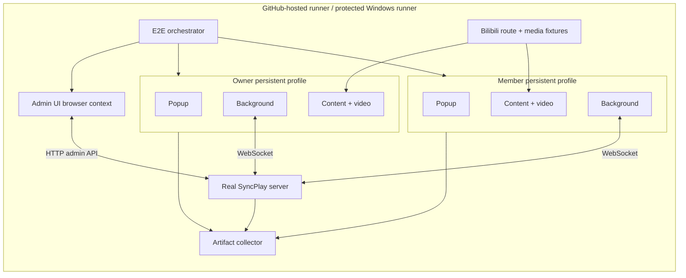

# 自动化实机测试：技术设计

**状态：提案，尚未实现。**

**基线：`6cc0702`（2026-08-03）。** 本文中的目录、脚本名和 CI job 名都是拟议接口；当前仓库中不存在 `packages/e2e` 和下文列出的浏览器 E2E 命令。

相关文档：

- [需求规格](./automated-real-browser-testing-requirements.zh-CN.md)
- [实施任务](./automated-real-browser-testing-tasks.zh-CN.md)

## 1. 设计摘要

采用四层测试金字塔，而不是让所有场景都依赖真实 Bilibili：

1. 保留现有单元、组件、协议、Redis、多节点和基准测试。
2. 新增每个 PR 必跑的确定性 Chromium 双客户端 E2E：真实扩展、真实浏览器、真实服务端，可控页面和媒体。
3. 新增受保护 Windows runner 上的 Chrome、Edge、Firefox 实机 smoke，并保留 WSL 服务端与 Windows 浏览器的跨时钟域组合。
4. 新增低频真实 Bilibili canary，用来发现 DOM、SPA 导航和播放器集成漂移；它不替代确定性门禁。

核心取舍是把两类故障拆开：

- 产品链路故障应在不联网的确定性层稳定复现并阻止合并。
- Bilibili、账号、CDN、浏览器自动更新等外部故障应在实机/真实站点层被看见，但不能随机污染每个 PR。

## 2. 设计决策

### D1：Chromium 主执行器使用 Playwright

原因：

- Playwright 能以 persistent context 加载 MV3 unpacked extension，并能取得 service worker、page、popup、trace 和网络路由。
- 两个 persistent context 可以自然表达两个隔离用户。
- admin-ui 可以复用同一测试运行器，不需要再维护一套浏览器断言框架。
- 现有 `scripts/e2e-smoke-plan.mjs` 已把 Playwright 作为拟议工具，继续该方向能减少概念迁移。

限制：

- Playwright 扩展测试的可靠基线是其自带 Chromium，不能把结果标成稳定版 Chrome/Edge 已验证。
- 扩展必须使用 persistent context；普通 `browser.newContext()` 不适用。
- 纯渲染、输入和错误反馈可以通过 `chrome-extension://<id>/popup.html` 测试；凡是依赖活动 tab 的分享、打开共享视频等流程，都先激活 Bilibili tab，再通过 `chrome.action.openPopup()` 打开真实 action popup 并捕获其 page。Phase 0 必须证明目标 Chromium 支持这一入口。
- `REQ-F032` 依赖测试运行器能主动终止而不是仅等待空闲挂起 MV3 service worker。Phase 0 必须用选定 Playwright/Chromium 版本证明：双方先通过真实入口绑定同一共享视频，浏览器调试协议再确实终止已加入该同步房间的目标扩展 worker；下一次 popup/content 生产事件重新启动 worker、恢复持久化房间会话并完成重连及跨端消息闭环，且恢复不是未真正失效的旧执行上下文、自动重试或测试后门造成的假象。popup 周期在终止前必须显式关闭旧 popup、确认旧文档及 port 消失，再从全新 action popup 触发；当前新 popup 先建立 runtime port、随后才查询状态。bootstrap pending 时首次查询可以返回默认过渡快照，不能要求它立即已入房；最终恢复由后续 port 更新与服务端房间收敛证明。受控页面重载则先请求页内分享按钮设置、随后才执行房间 hydration。首事件负责证明唤醒归因，查询/hydration 另负责证明对应消息路径工作，不能把后者倒推成唤醒源。只恢复未入房或没有共享视频的 popup 不算通过。Playwright 可以保留同一个 Worker 对象句柄，但不能把句柄存活误判为旧 worker 仍在运行。若 Playwright 暴露的 CDP 能力不足，必须在进入 M1 前调整适配器，而不是把风险留到生命周期矩阵。
- 不使用脆弱的操作系统坐标点击作为主要入口；坐标点击只可能作为稳定版浏览器最外层 smoke，不能承载功能矩阵。

官方能力参考：

- [Playwright：Chrome extensions](https://playwright.dev/docs/chrome-extensions)
- [Chrome：End-to-end testing for Chrome Extensions](https://developer.chrome.com/docs/extensions/how-to/test/end-to-end-testing)
- [Chrome：Test service worker termination with Puppeteer](https://developer.chrome.com/docs/extensions/how-to/test/test-serviceworker-termination-with-puppeteer)

### D2：Firefox 使用独立 WebDriver 适配器

Playwright 的 extension fixture 不覆盖 Firefox 扩展，因此 Firefox lane 使用 Firefox 专用构建加 Selenium/geckodriver：

- 构建 `extension/dist-firefox`，再生成或直接临时安装 XPI。
- 使用全新 Firefox profile；通过 WebDriver 临时安装 addon。
- 用 WebDriver 驱动 Bilibili 页和 popup；以用户可见状态断言，不依赖 Chromium service worker API。
- Firefox 随机内部 UUID 由启动后的浏览器实例发现；测试服务端精确放行该 Origin，或仅在专用 Firefox 场景使用格式受限的 `ALLOW_ANY_FIREFOX_EXTENSION_ORIGIN`。
- Firefox 不复用 Playwright route。它通过仅作用于临时 profile 的代理或 DNS 映射，把 `www.bilibili.com` 和 `api.bilibili.com` 指向回环 HTTPS fixture server；测试 CA 只导入该临时 profile，绝不修改操作系统 hosts 或系统信任库。

参考：[Selenium Firefox API](https://www.selenium.dev/selenium/docs/api/javascript/module-selenium-webdriver_firefox.html)。

### D3：新增独立 `@bili-syncplay/e2e` workspace

拟议目录：

```text
packages/e2e/
  package.json
  playwright.config.ts
  tsconfig.json
  fixtures/
    media/
    pages/
  src/
    fixtures/
      bilibili-site.ts
      browser-client.ts
      extension-build.ts
      server-runtime.ts
      test-run.ts
    models/
      admin-page.ts
      bilibili-page.ts
      popup-page.ts
    oracles/
      playback.ts
      room.ts
      stability.ts
    policy/
      timing.ts
      matrix.ts
    reporting/
      artifacts.ts
      metadata.ts
  test/
    smoke/
    popup/
    playback/
    navigation/
    lifecycle/
    admin/
    model/
```

选择 workspace 而非散落在 `scripts/` 的原因：

- 明确拥有依赖、tsconfig、测试目录和命令。
- 测试源码能进入仓库 `npm run typecheck`，符合每个 package 的 `test/**` 必须被类型检查覆盖的规则。
- fixture、page model、oracle 和场景分层，避免把进程编排、DOM 操作和业务断言写进同一个超长测试文件。

`packages/e2e` 不生产运行时包。根脚本只负责按明确顺序调用构建和测试，不复制编排逻辑。

### D4：不在生产代码增加万能测试后门

测试优先从用户入口和公开浏览器 API 驱动：

- popup 操作通过 DOM 和 `chrome.runtime` 的真实监听链路。
- 播放操作通过页面中的真实 `HTMLVideoElement`。
- 房间观察通过 popup、接收端播放器和公开 admin API。
- service worker 终止通过 Phase 0 已验证的浏览器调试协议路径，而不是新增生产消息；终止前后要用目标 ID、worker 执行上下文、触发入口实际发出的首个生产事件和恢复后的用户消息闭环证明被关闭的是当前生产 worker。popup 周期还要证明旧文档/port 已关闭、新文档确实创建；popup port 或 content 设置 hydration 等先行事件必须如实记录，不能为了让后续查询/房间 hydration 看似负责唤醒而绕过真实入口，也不能把 bootstrap pending 的查询过渡态误判成恢复失败。

只允许添加以下窄观测能力，并要求单独评审：

- 稳定且语义化的 DOM 属性，例如对无可访问名称控件补 `aria-label`。
- 已对用户或故障排查有价值的结构化日志。
- 构建时完全剔除且有测试证明不会进入发布包的 test-only 入口。

不得添加“直接设置房间状态”“跳过 Origin 校验”“强制认定当前页为共享视频”之类会绕过被测链路的接口。

### D5：页面夹具保留 Bilibili URL，内容保持最小可控

内容脚本只匹配 `https://www.bilibili.com/...`，因此确定性测试也必须让浏览器认为页面位于该 Origin。首选方案：

1. 在 context/page 导航前注册 Playwright route。
2. 对受支持的 Bilibili URL fulfil 最小 HTML 页面和本地合成媒体。
3. 对 `https://api.bilibili.com/x/web-interface/nav` fulfil 游客或专用用户响应。
4. 保留地址栏 URL、history 和 SPA navigation 语义，使 manifest 匹配、URL 归一化和导航控制器都走生产路径。

Phase 0 spike 必须证明 route-fulfilled 主文档仍会触发 manifest content script 注入和 page bridge。如果目标 Chromium 版本不满足这一点，回退方案是专用 HTTPS fixture server 加浏览器 `host-resolver-rules`，而不是扩大生产 manifest 的 host 权限。

Firefox 确定性 lane 始终使用回环 HTTPS fixture server，因为 Selenium/geckodriver 不能复用 Playwright route。Phase 0 必须在临时 Firefox profile 中选定并记录一种可重复的 profile 级代理或 DNS 映射方案，给 `www.bilibili.com`、`api.bilibili.com` 提供由临时测试 CA 签发的证书，并证明：地址栏和页面 Origin 仍是 Bilibili、content script 与 page bridge 会注入、所有目标请求均命中本地 fixture、未发生公网回退。profile 删除即撤销映射和证书信任。

页面夹具约束：

- 只实现扩展实际依赖的 DOM、页面快照和导航信号，不复制整页 Bilibili HTML。
- 每种受支持路由有独立 fixture contract。
- 普通视频、多 P、番剧、festival、两种稍后再看路径使用不同 ID 和标题，防止用例因值相同而误通过。
- 提供可控制的 metadata 延迟、buffering、视频元素重建、自动连播和快速连续导航。
- 为 `playback.user.hold-fast-forward` 提供与当前 Bilibili 语义一致的键盘契约：短按 ArrowRight 仍是 5 秒 seek，持续按住并进入重复 keydown 后才把 live rate 临时切到 3×，keyup 恢复长按开始时保存的 rate；场景必须用浏览器键盘 API 驱动这条页面路径，不能由测试直接写媒体属性。
- 确定性同步媒体包含音轨但从初始 HTML 就带 `muted` 属性，并在任何生产脚本绑定前把实例的 `muted` 属性设为 `true`；页面 contract 暴露只读断言证明两端首个远端 play 前仍静音。browser/page fixture 不得先调用 `play()` 制造用户激活，也不得用 `--autoplay-policy=no-user-gesture-required` 等启动参数绕过全新 profile 的默认策略。另保留一个从相同 contract 单独取消静音的诊断变体，确认默认策略拒绝远端有声 `play()` 时 `NotAllowedError` 及生产诊断可见。
- 媒体为短小、自有或明确可再分发的测试资源；至少包含足够时长执行 seek、倍速和 ended 场景。

## 3. 总体架构



## 4. 组件设计

### 4.1 Test run coordinator

每次运行创建一个 `runId`、一个经校验的运行时临时根和一个独立 artifact 暂存根，负责：

1. 记录 commit、OS、浏览器版本和随机种子。
2. 先在随机回环端口启动本次运行独占的 bootstrap sink；WSS 场景还须在浏览器启动前生成本次 run 的临时 CA、SAN 只包含 `wssUrl` 实际回环主机名/IP 的叶证书，以及仅供隔离 profile 使用的信任描述。再用 `BILI_SYNCPLAY_DEFAULT_SERVER_URL` 把测试构建的默认地址指向 sink。在跨进程构建锁内完成生产构建、校验 manifest，并把产物原子复制到 `.tmp/e2e-runtime/<runId>/extension/<target>/`；浏览器只加载这份 run-scoped 不可变副本，复制完成后才释放构建锁。sink 只处理启动探测并记录意外请求，不承载房间协议。
3. 使用上一步的可选信任描述启动 owner/member 浏览器上下文并发现扩展 ID/Origin；此时任何自动连接只能命中 bootstrap sink，不能接触日常开发服务或公网。默认并发只有在两个 run 同时构建、启动和重启 background 的隔离压力测试通过后启用；此前 Playwright 固定 `workers: 1`。
4. 以发现的 Origin 启动真正的同步服务端；端口使用 `listen(0)` 取得。需要核验 `wss://` 时，再启动只转发到该实例的受管 TLS facade；它使用本次 run 的临时证书和独立随机回环端口，同时代理 HTTPS 普通请求与 WebSocket upgrade。
5. 把真正的 `ws://` 或 `wss://` 服务端 URL 交给 page model，由 popup UI 保存；若当前尚无房间操作，继续通过 create/join 用户入口触发连接，再确认握手并关闭 bootstrap sink。
6. 运行场景并持续收集浏览器、worker 和服务端日志到 artifact 暂存根。
7. 先关闭浏览器，再等待同步服务端与 fixture server 完整 shutdown，最后只清理运行时临时根；完成的 artifact 暂存根保留给调用方或 CI 上传步骤。

所有资源进入显式 LIFO disposer stack。某一步启动失败时仍运行已注册 disposer；任何 disposer 超时都会写入结果并使 job 失败。

完整矩阵通过 `RedisRuntimeFixture` 取得 Redis。未设置 `REDIS_URL` 时采用 managed 模式：校验受支持的 `redis-server` 版本，生成关闭持久化且只绑定回环地址的临时配置，以随机端口启动子进程，立即登记 disposer，再等待 `redis-cli ping` 成功。设置 `REDIS_URL` 时采用 external 模式：不管理外部进程，但仍须在场景前健康检查，并为每个 run 创建、登记和清理唯一 key 前缀。两种模式都不得在 Redis 不可用时跳过 `REQ-F037`；managed 进程退出、前缀清理或健康检查失败都合并进根命令退出结果。CI 的 job-scoped service 使用 external 模式，本地开发和 CI 外 soak 默认使用 managed 模式。

目录生命周期严格分离：run-scoped 不可变扩展副本、profile、socket 和媒体临时文件位于 `.tmp/e2e-runtime/<runId>/`，根测试命令返回前必须清理；待上传材料位于 `.tmp/e2e-artifacts/<runId>/`，根命令只完成定稿并返回其路径，CI 在 `upload-artifact` 完成后另行清理。两类删除都必须校验精确 runId 路径。

### 4.2 Extension build fixture

- Chromium lane 使用生产命令生成 `extension/dist`，但在持有跨进程构建锁时立即复制到本次 run 的不可变目录；persistent context 只加载副本，不直接加载可变的 `extension/dist`。
- Firefox lane 同样从 `extension/dist-firefox` 生成 run-scoped 不可变副本或临时 XPI；打包、复制完成前不释放构建锁。
- 确定性测试构建通过项目已有的 `BILI_SYNCPLAY_DEFAULT_SERVER_URL` 构建参数指向本次 bootstrap sink；fixture 必须在副本 manifest/脚本中校验该值绑定当前 runId，发布构建流程和仓库默认值不因此改变。
- fixture 在启动前检查 manifest 目标形态：Chromium 必须是 `background.service_worker`，Firefox 必须是 `background.scripts`。
- 构建锁覆盖“清理共享 dist → 构建 → 校验 → 原子复制”的完整临界区；浏览器启动后副本设为只读，任何后续构建不得修改它。两个 run 的 bootstrap URL、文件 inode/内容哈希和 background 重启结果必须互不串扰。
- 不缓存跨 commit 的 build 输出；CI artifact 复用时必须同时绑定 commit SHA、目标浏览器和构建参数，复用后仍复制到 run-scoped 目录。
- 扩展 ID 默认从启动后的 worker/page 发现，不要求把私钥或商店签名密钥放入 E2E。

### 4.3 Server runtime fixture

第一阶段直接导入 `createSyncServer` 创建内存模式实例，而不是另起一个难以观测的 shell daemon。server runtime fixture 是 bootstrap sink 的唯一所有者，并提供两阶段接口：`prepare()` 在浏览器启动前建立 sink、可选临时证书及 profile 信任描述，`start(allowedOrigins)` 在浏览器 Origin 发现后才启动后端和可选 TLS facade。真实同步握手确认后，coordinator 调用幂等的 `closeBootstrapSink()`，它只关闭 sink；最终幂等的 `close()` 按逆序关闭仍存活的 sink、TLS facade 和同步后端，因此启动中途失败也不要求调用方复制清理逻辑：

- 使用真实 HTTP/WebSocket handler、消息校验和 room service。
- `allowedOrigins` 精确来自本次浏览器上下文。
- E2E-004 的 M0 spike 和 admin-ui 场景都向 `createSyncServer` 传入 run-scoped 测试管理员配置，session/event/audit store 均使用内存 provider；用户名、密码、密码哈希和 session secret 在测试进程内生成且不写文件。fixture 使用发现后已加入 `allowedOrigins` 的扩展 Origin 调用真实 `POST /api/admin/auth/login`，从成功响应中仅在内存保存 bearer token，再以 `Authorization: Bearer` 调用房间列表和详情；缺少或伪造 token 的同一路径必须返回 401，凭据和 token 不进入日志或 artifact。
- 监听回环地址和随机端口。
- 为 `popup.server-url.save-wss` 提供可选的受管 TLS facade：使用本次 run 生成的临时 CA，以及 SAN 只包含 `wssUrl` 实际回环主机名/IP 的叶证书终止 HTTPS/WSS，只允许代理到同一 fixture 的随机回环端口；普通 HTTPS 请求必须转发 `/api/connection-check` 和 `/` 并保留 Origin/CORS 语义，WebSocket upgrade 转发到同一后端。CA 信任限制在隔离浏览器 profile 的生命周期内；不得修改系统信任库、关闭全局证书校验或借用公网 WSS。fixture 暴露 `wssUrl`，并验证浏览器实际依次完成 HTTPS 预检、TLS、WebSocket 和同步协议握手；SAN 不匹配、错误 CA、错误目标或 profile 外连接必须失败。
- `closeBootstrapSink()` 返回前必须等待 sink 端口可重新绑定，同时保持同步后端和可选 TLS facade 可用；`close()` 在任何阶段均可安全调用，并汇总各资源的关闭失败。
- 结构化日志写入本次 artifact 目录并同步进入内存 ring buffer，供失败摘要使用。

普通场景默认使用上述内存实例。为 `REQ-F037` 单独增加一个隔离的 Redis/双节点模式：

- 每次运行使用唯一 Redis key 前缀，两个 server/runtime store 节点共享 Redis 和事件总线；存活浏览器客户端与随后离线节点上的成员位于同一房间。
- 通过可控租约让后一节点离线，由 reaper 清理其会话；事件总线故障注入只拒收首次清理通告 `room_state_updated`，此后不再执行任何房间操作。
- 下一次 sweep 即使已经找不到离线节点或该房间，也必须在提前返回前重试保留记录；最终只通过这条重试让存活客户端移除幽灵成员并刷新分享所有者。
- 负向控制临时停用保留记录重试后必须稳定失败，以证明用例不是被后续房间广播意外治愈。

进程入口和信号行为继续由现有专项测试负责；Redis/多节点模式只服务上述代表性确定性场景，不扩散到全部浏览器 E2E。夜间仍可增加一条使用真实 `server/dist/index.js` 和 Redis 的浏览器 smoke。

### 4.4 Browser client fixture

每个客户端暴露窄接口：

```ts
interface BrowserClient {
  role: "owner" | "member";
  extensionId: string;
  origin: string;
  openBilibili(url: string): Promise<BilibiliPage>;
  openPopup(): Promise<PopupPage>;
  terminateBackground(): Promise<void>;
  setOffline(offline: boolean): Promise<void>;
  snapshot(): Promise<ClientSnapshot>;
  close(): Promise<void>;
}
```

fixture 不暴露 extension store 的任意写接口。`snapshot()` 只读取用户可观察状态和诊断字段，并明确标注每个采样值属于哪个本地时钟。

### 4.5 Page models

Page model 只封装稳定交互，不承担业务判定：

- `PopupPage`：服务器地址、房间表单、邀请、成员、共享视频卡片、设置和日志；实例记录它来自 action popup 还是普通扩展页，活动-tab-dependent 操作拒绝在普通扩展页实例上执行。
- `BilibiliPage`：视频元素、页面身份、可见 toast、页内分享按钮、导航、真实键盘长按/释放和 fixture 控制面。
- `AdminPage`：登录与已有 token 的身份恢复重试；通过真实侧栏菜单分别导航到 overview、rooms、events、audit、config，并核验 path、页头标题、唯一选中项和目标页面内容；处理房间选择、详情、每种单项/批量治理确认框的确认与取消，以及批量结果框关闭。取消和结果关闭 helper 必须点击真实按钮并观测稳定窗口内没有治理请求，不能直接调用 React 回调或移除 DOM。

业务断言放在 oracle；例如 `PopupPage.shareCurrentVideo()` 只点击并处理 confirm，是否同步成功由 room/playback oracle 判断。

### 4.6 Oracles

#### Room oracle

聚合两端 popup、共享视频 URL、成员列表和必要的 admin API 结果，验证：

- 房间码和成员身份一致。
- 共享 URL 经规范化后相等。
- 所有者变更由完整房间态最终收敛，而非只看成员增量；故障注入可拒收首次归属重同步 `room_state_updated`，并验证无需后续房间操作或页面刷新，重试轨迹仍会送达当前完整房间态。
- reaper 清理离线节点后，客户端的幽灵成员和陈旧所有者必须由保留记录重试收敛；首次通告失败后不得借助后续用户操作或页面刷新触发新的房间广播。
- 管理动作被真实客户端观察。

#### Playback oracle

对两端在同一轮采样中分别读取：

```text
location URL / resolved video identity
currentTime / paused / ended / readyState / playbackRate
performance.now() / sample sequence
```

判定只比较同一客户端本地经过时长，或比较近同时采样的两个播放器状态；绝不计算 `serverTime - localNow`。统一策略模块定义：

- 状态收敛等待上限。
- paused/seek 静态位置容差。
- playing 动态位置容差。
- 倍速容差。
- 采样间隔和连续稳定次数。

具体数值由 Phase 0 结合当前 `playback-reconcile.ts` 阈值和 Windows 实测校准，未经基线数据不在本文拍脑袋固定。

长按快进 oracle 先通过真实房间状态制造一个尚未结束的 rate-only soft apply 会话，再由页面夹具响应真实 ArrowRight hold/release。采样须同时证明四件事：发起端确实短暂进入 3×；该手势触发并被服务端接受的快照仍携带按住前的房间基础倍速；接收端在基础倍速下跟进发起端超出普通播放推进量的位置；释放后双方在稳定窗口内保持同一基础倍速。永久倍速操作、直接写 `HTMLVideoElement` 或只看最终倍率均不能替代这些证据。两个单因素负向对照分别把 ArrowRight 错认成永久倍速接管、以及让 ArrowRight 不刷新一般用户手势；前者只能因倍率污染失败，后者只能因位置跳跃未及时传播失败，夹具未进入 3× 或纠偏前置条件不成立不能算有效红灯。

跨时钟场景通过 E2E-only WSL launcher 使用现有 `ServerBootstrapDependencies.now` 注入点控制服务端逻辑墙钟，不修改 Windows 或 WSL 系统时钟，也不改变浏览器本地单调钟。每次正向实现或负向对照都创建全新的 server 进程、房间和浏览器 profiles：先固定注入 `+D`，直到 `sync:ping` 原始样本与 popup 已发布诊断值一致；随后在时长 `T` 内把偏移从 `+D` 线性降到 `0`，其中 `D >= max(5_000ms, 4 × playing 动态位置容差)`、`T >= 2 × CLOCK_SYNC_INTERVAL_MS` 且以毫秒计 `T > D`。因此注入时钟以 `1 - D/T` 的正速率前进，取整后的服务端时间与播放版本也不得倒退，但滤波后的 `clockOffsetMs` 会落后于当前原始钟差。runner 必须从每次 pong 的原始 out/in 分量和 popup 值证明两者之差至少大于 playing 动态位置容差，并在这个滞后窗口让 owner 连续产生新的 playing 快照；未形成该滞后、任一版本时间倒退或诊断缺失都属于夹具失败。正确实现只用本地单调到达锚点，须持续进入稳定窗口；负向对照仅临时在当前代码中恢复 `estimatedServerNow = localNow + clockOffsetMs` 再减 `playback.serverTime` 的 #210 前位置补偿，必须因滞后的估计持续过度外推而越过容差。进程终身固定的 `+D`/`-D` 会让偏移同时进入估计值与快照时间而抵消，不能作为这项负向对照。

#### Stability oracle

在一次用户操作完成后的观察窗口内统计：

- 服务端收到/广播的 `playback:update` 数量。
- actor/seq 是否持续向前。
- 是否出现状态来回翻转。
- 是否有未处理页面错误、worker 崩溃或连接泄漏。

它用于发现“结果看似正确但发生回声风暴”的假通过。消息上限按操作类型集中配置。

### 4.7 Artifact collector

拟议输出：

```text
.tmp/e2e-artifacts/<runId>/
  metadata.json
  summary.md
  server.ndjson
  owner/
    steps.ndjson
    trace.zip          # 仅无凭据场景存在
    console.ndjson
    final.masked.png
    playback-samples.json
  member/
    ...
  admin/
    steps.ndjson
    console.ndjson
    final.masked.png
  firefox-owner/
    geckodriver.log
    webdriver.ndjson
    console.ndjson
    event-page.ndjson
    final.masked.png
    network.ndjson  # 仅在 BiDi 网络能力可用时
```

采集策略在场景启动前由敏感能力 tag 决定。无凭据的 Chromium/Playwright 上下文产出 `trace.zip`；凡会创建、复制、展示或输入邀请串、token、密码或 cookie 的场景（包括 P0 建房/入房、管理员登录和真实账号场景），都从上下文启动时关闭原始 trace/HAR/网络正文，改用页面步骤、脱敏 console、播放器采样、遮罩截图和服务端事件作为等价诊断。第一阶段不把事后清洗 Playwright DOM snapshot 或内嵌截图视为可靠边界，也不先捕获再因扫描失败丢掉关键诊断。Firefox/Selenium 不伪造 Playwright trace，而产出 geckodriver/Marionette、经过清洗的 WebDriver 事件、console、event page 和遮罩后的截图，并只在 BiDi 网络事件能去除敏感头、cookie 和正文时追加它们。

artifact collector 维护两层防线：采集时按字段 allowlist 丢弃 `Authorization`、`Cookie`、请求/响应正文和敏感 DOM 区域，并验证带敏感能力 tag 的场景没有启动 trace/HAR；定稿时用本次运行登记的所有 token、密码、cookie、邀请串及通用秘密模式扫描文本和解包后的归档内容。正常敏感流程应靠采集模式留下安全的等价诊断；若扫描仍命中秘密，说明 collector 或 adapter 违反边界。任一文件无法解析、无法可靠清洗或命中秘密时，不进入上传清单；collector 生成不含秘密的失败摘要并使 job 失败。扫描器自身必须有包含 trace.zip、HAR、WebDriver 日志和截图遮罩的正负测试。

CI 无论成功或失败都上传已通过扫描的 `metadata.json` 和摘要；trace、截图、详细日志默认只在失败时上传，以控制存储量。运行时清理在 artifact 定稿后执行，但不得删除 artifact 暂存根；CI 上传完成后再由独立步骤删除该根。两者都只能删除已验证属于本次 runId 的明确路径。

## 5. 确定性场景设计

### 5.1 P0 smoke

单条场景完成最小完整旅程：

1. owner 打开普通视频夹具。
2. owner popup 保存随机服务端地址并创建房间。
3. 从剪贴板读取邀请串。
4. member popup 保存与 owner 相同的随机服务端地址，再输入邀请串加入。
5. owner 分享当前视频。
6. member 自动打开共享视频。
7. 在没有任何 fixture 直接 `play()` 或伪造用户激活的前提下，先断言 owner/member 媒体均从解析起保持静音，再由 owner 依次 play、seek、修改倍速、pause。
8. 每步用 playback oracle 等待收敛，并用 stability oracle 排除回声风暴。
9. member 离房，owner 观察成员消失。
10. 关闭两个浏览器和服务端，验证无遗留资源。

这条场景必须在 5 分钟内完成，是基础设施是否可用的第一判据。

### 5.2 分域场景

- Popup：输入、确认框、剪贴板、pending/错误和设置持久化。
- Playback：每种媒体事件、软追赶、hard seek、缓冲和 ended；独立有声变体在默认自动播放策略下验证远端 `play()` rejection 及诊断链路，主同步场景则用初始静音媒体确定性穿过同一生产调用路径。
- Navigation：五种路由、多 P、festival 快照、自动连播、非共享本地浏览和连续导航竞态。
- Lifecycle：service worker 终止、离线/在线、服务端重启、tab reload/close、浏览器退出。
- Ownership/concurrency：晚加入、近同时操作、成员断连、所有者转移、房间切换，以及首次归属重同步或 runtime index reaper 清理通告被事件总线拒收后的独立重试收敛。
- Admin：真实扩展客户端配合后台治理；五个单项和两个批量治理对话框逐一验证确认/取消，批量结果框验证关闭，房间表格验证选择与清空选择。

同一行为的细粒度边界继续放在单元测试中；浏览器 E2E 只保留能穿过多个运行时边界、且替身无法证明的代表场景。

## 6. 状态模型

第二阶段引入有界模型生成，不直接随机点击：

```text
Connection = invalid-url | disconnected | connecting | connected
Room       = idle | entering | joined | leaving
Page       = none | shared | non-shared | navigating
Playback   = absent | paused | playing | buffering | ended
Ownership  = none | owner | peer
```

操作带前置条件和预期后置条件。例如 `share-current-video` 只在 `Page != none` 时生成；`leave-room` 后必须等待 `Room = idle` 才生成下一次 join。每条生成序列：

- 固定最大步数和运行预算。
- 记录 seed、每步输入和每步观测。
- 失败可用相同 seed 重放。
- 对重要状态边使用显式覆盖计数，而不是用代码覆盖率替代行为覆盖率。

## 7. CI 与实机拓扑

### 7.1 GitHub 托管 PR job

最终完整门禁 job：`browser-e2e`；M2 的 E2E-207 先接入独立且非 required 的阶段性 `browser-e2e-smoke`。

- Ubuntu GitHub-hosted runner。
- `npm ci` 后安装与锁定版本匹配的 Playwright Chromium。
- 最终 `browser-e2e` 在同一 job 内通过 GitHub Actions service 启动锁定版本的 Redis，并配置 `redis-cli ping` 健康检查；不得依赖并行 `redis-integration` job 的 service。健康后才把 job-scoped `REDIS_URL` 传给 run coordinator，由 coordinator 为 `REQ-F037` 生成唯一 key 前缀、登记并清理该前缀；service 容器由 Actions 随 job 回收。Redis 启动、健康检查、连接或前缀清理失败都使 job 非零。只覆盖 M2 的非 required `browser-e2e-smoke` 可以不启动 Redis。
- 构建 protocol、server、extension、admin-ui 和 e2e 类型。
- 先跑 P0 smoke；失败则立即上传 artifact，不继续跑长矩阵。
- smoke 通过后运行确定性分域场景和 admin-ui 真实客户端治理场景。
- 与现有 `verify` 并行，最终都作为 branch protection required checks。
- E2E-207 必须在 M2 接入 `browser-e2e-smoke`，以非 required 信号取得 GitHub-hosted P0 实测；E2E-501 在 M3/M4 完成后先让 non-required 的 `browser-e2e` 与它并存。只有需求—场景追踪检查和 100 轮稳定性基线全部完成，且权威表中的每个 P0/P1 展开操作键、断言策略、必要断言键及必要断言类别都有实际执行证据后，E2E-506 才能把 `browser-e2e` 设为 required 并停用阶段性 smoke。两个 job 不复用检查上下文。
- E2E-501 的 GitHub-hosted 单轮实测和 E2E-504 的 100 轮分布必须在 E2E-506 前共同关闭 `REQ-N001` 的当前 10 分钟目标。未达到时先优化；若证据表明目标必须调整，则先在需求规格中提交有依据的新预算并取得评审同意，不能只记录一个更慢的数字后照常提升 required check。
- 稳定性基线执行拟设为 required 的完整 `browser-e2e` 命令 100 次，逐域记录 P0、P1 和 admin-ui harness failure；只重复 P0 smoke 不能证明完整门禁可用。
- `docs/design/automated-real-browser-testing-requirements.zh-CN.md` 承载第 5.1 节权威操作/策略映射，不属于可跳过的纯文档：该文件有改动时必须运行完整 `browser-e2e` 和规格—catalog 漂移检查。其他文档/翻译是否跳过由经过表驱动测试的路径分类器决定，未知路径默认运行。
- M1 先落地追踪基础设施：把需求规格第 5.1 节展开为机器可读 operation catalog；每项包含唯一 `operationKey`、所属 `requirementId`、priority、与权威表一致的独立 `assertionPolicy`、非空 `requiredAssertionKeys`、断言键到类别的固定映射和 `requiredAssertionCategories`。策略表达式必须让每个展开键恰好匹配一次；校验器不能从断言类别反推操作是否跨端。证据类别拆为发起端用户可见、真实接收端结果、服务端结果和稳定窗口；`local-stable` 必须包含发起端可见结果和稳定窗口，`server-observed-visible` 必须包含重启后的发起端可见结果、服务端结果和稳定窗口，`peer-sync` 必须包含真实接收端结果及另外一类，`peer-sync-strict` 必须同时包含发起端、真实接收端和稳定窗口，`server-result` 不得补 `peer-result` 的缺口。共享 helper 在每个 catalog 操作实例开始时分配本次尝试内唯一的 `operationExecutionId`，覆盖真实用户动作、自动加载/刷新、生命周期事件和 runner 驱动的后台终止、浏览器退出、reaper 等非手势操作；每条运行证据携带 `runId`、`scenarioId`、`attemptId`、`operationExecutionId`、本次尝试内唯一的 `evidenceId`、完全展开的 `operationKey`、`assertionKey`、requirement ID、断言类别、结果和时间。门禁以 `(runId, scenarioId, attemptId, operationExecutionId, operationKey)` 为执行组，对组内实际通过证据分别计算必需断言键和必要类别集合差，并校验证据类别等于 catalog 中该断言键的类别；只有至少一个执行组同时满足该操作的全部要求才计覆盖，不能跨执行组、场景或重试求并集。catalog 内重复键、把同一 `operationExecutionId` 分配给两个不同的 catalog 操作实例、同一次尝试内重复 `evidenceId`、未知键、花括号/通配键、策略或类别错配、空测试、未执行断言及只声明 ID 的场景都失败。不同场景或尝试可各自完整核验同一操作：报告保留全部执行组；首次失败或 skip 仍由测试运行器独立使 job 失败，不能被后续完整执行组覆盖。

拟议根命令（实现前不可用）：

```bash
npm run test:e2e:browser:smoke
npm run test:e2e:browser
```

### 7.2 受保护 Windows runner

拟议标签：`self-hosted,windows,x64,bili-syncplay-e2e`，并强制最大并发为 1。

- 只响应 `main` 定时任务、tag/release 或维护者批准的手动 dispatch。
- 不直接执行外部 fork PR 的代码。
- 使用专用低权限 Windows 用户、独立浏览器安装和独立工作目录。
- 每次运行创建新 profile；Bilibili 登录态如确有需要，从凭据库复制到临时 profile，用后销毁。
- WSL 场景由 Windows 编排器调用固定、受控的 WSL 入口启动当前 SHA 的 server 构建；不得使用维护者正在开发的工作树。
- 跨时钟场景由 E2E-only WSL launcher 导入当前构建的生产 bootstrap，并仅通过 `ServerBootstrapDependencies.now` 控制服务端逻辑墙钟；正向实现和负向对照各自启动全新的 server 进程、房间和浏览器 profiles，先在固定 `+D` 下等待校时稳定，再以 `T >= 2 × CLOCK_SYNC_INTERVAL_MS`、且以毫秒计 `T > D` 的线性漂移把偏移降至 `0`，其中 `D >= max(5_000ms, 4 × playing 动态位置容差)`。全程不得修改宿主机或 WSL 系统时钟；注入后的时间和版本不得倒退，测试结束后注入随对应进程退出。

GitHub 明确说明持久化 self-hosted runner 可能被不可信 workflow 持久化攻陷；公开仓库必须把可信 SHA 和 runner 隔离作为设计前提。参考：[GitHub Actions secure use](https://docs.github.com/en/actions/reference/security/secure-use)。

### 7.3 真实站点 canary

真实站点场景与确定性场景使用不同 project/tag，例如 `@live-site`：

- 低频串行运行，不做并发抓取。
- 公开页面优先；登录场景不自动处理验证码。
- 首先验证页面可访问和 fixture 外部前置条件，再执行扩展断言。
- 结果分成 `passed`、`product-failed`、`external-blocked` 三态。
- `external-blocked` 不等于通过；连续两次或超过 24 小时无有效结果时告警。

## 8. 浏览器矩阵

| 能力                               | Chromium fixture | Chrome stable | Edge stable  | Firefox stable   | 真实 Bilibili |
| ---------------------------------- | ---------------- | ------------- | ------------ | ---------------- | ------------- |
| 每 PR 双客户端全链路               | 全量             | 否            | 否           | 否               | 否            |
| popup 核心操作                     | 全量             | smoke         | smoke        | smoke            | smoke         |
| 五种页面 route contract            | 全量             | 普通页 smoke  | 普通页 smoke | 普通页 smoke     | 公开页 canary |
| 播放/暂停/seek/倍速                | 全量             | smoke         | smoke        | smoke            | smoke         |
| service worker/event page 生命周期 | 全量 SW          | SW smoke      | SW smoke     | event page smoke | 不单独依赖    |
| WSL/Windows 跨时钟                 | 否               | 全量核心      | 可选         | 可选             | 核心 smoke    |
| 管理后台                           | 全量 Chromium    | 不重复        | 不重复       | 不重复           | 不依赖        |

“全量”指需求中的有界操作目录，不表示穷举全部序列。

## 9. 失败分类

| 分类     | 例子                                            | 处理                                                         |
| -------- | ----------------------------------------------- | ------------------------------------------------------------ |
| Product  | 接收端未 pause、所有者错误、回声风暴            | 保持失败；新增或更新回归测试。                               |
| Harness  | selector 属于测试自身、临时端口冲突、清理器错误 | 修测试基础设施；计入稳定性指标。                             |
| Browser  | 浏览器崩溃、driver 不兼容                       | 保留版本与崩溃日志；确定性层仍失败，实机层可标基础设施阻塞。 |
| External | Bilibili 503、验证码、视频下架、地区限制        | `external-blocked`；不伪装成产品通过。                       |
| Runner   | 机器离线、磁盘满、凭据不可读                    | infrastructure failure；告警维护者。                         |

自动重跑不得抹掉首次分类。允许一次带相同 seed 的诊断重跑，并在摘要中同时展示两次结果。

## 10. 备选方案及拒绝理由

### 只扩充现有 Node E2E

不能验证 manifest 注入、service worker 生命周期、`chrome.runtime`、活动 tab、真实 video 事件和 Bilibili DOM，因此保留为快速协议 smoke，但不足以满足需求。

### 每个 PR 直接访问真实 Bilibili

会把 A/B 页面、登录、CDN、风控和地区限制变成合并门禁，无法区分产品回归与外部波动，因此只用于 canary。

### 只在一台浏览器开两个 tab

两个 tab 共享 extension background、storage 和 socket，无法表示两个用户，也会掩盖成员身份、重连和广播问题，因此必须使用两个 persistent profile。

### 用内部 store/API 直接设置状态

虽然更快，但会绕过 popup/background/content 边界，重复现有单元测试的盲点，因此只允许读取有限诊断，不允许写状态。

### 用操作系统坐标全面驱动浏览器工具栏

对分辨率、缩放、浏览器主题和工具栏布局高度敏感。Chromium 确定性层优先调用 `chrome.action.openPopup()`；稳定版实机只保留一条必要的工具栏打开 smoke。与活动 tab 无关的 popup 行为才通过扩展页 URL 测试。

## 11. 开放问题与分阶段判定项

除第 8 项按其列出的后续门禁分阶段实测外，以下问题都必须在进入 M1 前通过可执行 spike 回答，答案记录到任务文档并更新本文。第 8 项在 Phase 0 只要求代表性样本和预算可行性，不能反过来要求尚不存在的 P0/完整套件给出实测结果：

1. 当前 Playwright/Chromium 版本下，route-fulfilled Bilibili 主文档是否稳定触发 manifest content script 和 page bridge。
2. `chrome.action.openPopup()` 能否在保持 Bilibili tab 活动的情况下稳定取得 popup page；headless 与 headed 是否一致。
3. 两个 persistent profile 从同一构建目录加载时扩展 ID 是否一致；若不一致，服务端能否精确放行两个 Origin。
4. headless 模式是否稳定产生项目依赖的 video 事件；哪些场景必须用 headed + Xvfb。
5. 当前稳定版 Chrome/Edge 是否能用自动化加载当前 commit 的扩展；若只能验证已签名产物，实机 lane 应明确标成发布产物验证。
6. Firefox 临时 XPI 的内部 UUID、popup 打开和 event page 日志怎样稳定取得；profile 级代理或 DNS、临时 CA 和回环 HTTPS fixture 怎样在不访问公网、不修改系统 hosts/信任库的前提下稳定提供 Bilibili Origin。
7. paused/playing 的位置容差和消息风暴上限是多少，才能既符合当前产品策略又能抓住真实回归。
8. GitHub-hosted runner 上的预算分三次关闭：Phase 0 记录空白扩展、双 profile/握手和媒体代表场景的耗时、CPU、内存及 artifact 样本，证明 5/10 分钟目标没有明显不可行；E2E-207 在真实 P0 命令存在后记录 P0 实测并验证 5 分钟目标；E2E-501/504 在完整命令存在后记录全量套件单轮和 100 轮分布，并在 E2E-506 前验证当前 10 分钟目标。未达标时必须先优化，或基于实测修改需求预算并取得评审同意。不得把后两项当作 E2E-007/M0 的前置条件，也不得用 Phase 0 估算冒充最终实测。
9. Linux/WSL 本地 managed Redis 应锁定哪些 `redis-server` / `redis-cli` 版本，怎样取得它们并证明随机端口、关闭持久化、健康检查和进程回收在干净环境可重复。
10. E2E-only WSL launcher 能否通过 `ServerBootstrapDependencies.now` 在隔离的新 server/房间/profile 中先稳定校准固定正偏移，再用至少两个 `sync:ping` 周期、且以毫秒计漂移时长大于漂移总量的线性降偏移制造超过 playing 动态位置容差的“已发布估计落后于当前钟差”，同时让注入时间和所有服务端版本单调不减；同一方案在全新负向对照进程中能否稳定复现，且全程不修改任一系统时钟。
11. Chromium 隔离 profile 能否在不修改系统信任库、不关闭全局证书校验的前提下，仅信任本次 run 的临时 CA，并让扩展 background 通过受管 `wss://` facade 的 HTTPS `/api/connection-check`、`/` 预检后完成真实 TLS/WebSocket/同步协议握手；错误证书是否稳定失败。
12. 选定 Playwright/Chromium 版本能否通过浏览器调试协议主动终止已加入真实同步房间、且双方已绑定同一共享视频的目标 MV3 service worker，并由下一次真实 popup/content 生产事件恢复持久化房间会话、重连和跨端消息处理；如何记录 popup port、content 设置 hydration 等实际首事件并证明是它触发新 target，而非错误 target、未终止上下文、alarm、自动重试或测试侧重载扩展。

任一 Phase 0 spike 失败都应调整设计或缩小第一阶段范围，不得用重试和 `sleep` 把不确定性藏进硬门禁。第 8 项的 P0/全量实测未到对应里程碑不算 Phase 0 阻塞，但到 E2E-207、E2E-501/504 时必须分别关闭，不能只保留估算。
