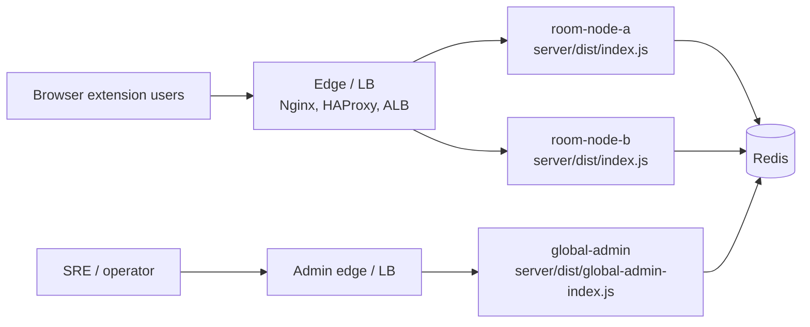

# Bili-SyncPlay 多节点运维 Runbook

[English](./multi-node-operations.md) | [简体中文](./multi-node-operations.zh-CN.md)

本文档面向日常运维和应急值班，覆盖多 Room Node、独立 Global Admin 与 Redis
共享控制面的扩容、缩容、Redis 故障、管理员口令轮换和常见告警定位。

## 适用范围

- 普通用户通过统一入口访问 `wss://sync.example.com`。
- Room Node 运行 `server/dist/index.js`，负责 WebSocket、`/healthz`、`/readyz`。
- Global Admin 运行 `server/dist/global-admin-index.js`，负责 `/admin` 与
  `/api/admin/*`。
- Redis 承载房间基础状态、运行时索引、事件流、审计流、房间事件总线、管理员会话和管理命令总线。

## 拓扑



Room Node 不内置负载均衡。生产入口层必须负责 TLS 终止、WebSocket 反向代理和连接分发。
WebSocket 是长连接流量，入口层优先使用 `least_conn`，再考虑轮询；sticky
路由只作为上线初期的运维兜底，不是多节点正确性的必要条件。

## 基线配置

所有 Room Node 与 Global Admin 应指向同一个 Redis，并保持以下配置一致：

```bash
REDIS_URL=redis://10.0.0.11:6379
ROOM_STORE_PROVIDER=redis
ADMIN_SESSION_STORE_PROVIDER=redis
ADMIN_EVENT_STORE_PROVIDER=redis
ADMIN_AUDIT_STORE_PROVIDER=redis
RUNTIME_STORE_PROVIDER=redis
ROOM_EVENT_BUS_PROVIDER=redis
ADMIN_COMMAND_BUS_PROVIDER=redis
NODE_HEARTBEAT_ENABLED=true
```

每个进程必须使用唯一 `INSTANCE_ID`。Room Node 使用 `PORT` 监听业务流量，并设置
`GLOBAL_ADMIN_ENABLED=false`；Global Admin 使用 `GLOBAL_ADMIN_PORT`，并设置
`GLOBAL_ADMIN_ENABLED=true`。

如果设置了 `REDIS_NAMESPACE`，它会作为所有 Redis 键和频道（房间、运行时索引、事件流、房间事件总线、管理命令总线）的前缀，因此所有 Room Node 与 Global Admin 必须使用同一个值；全部不设置时共同使用默认前缀 `bsp`。命名空间不一致会把集群分裂——表现为 Global Admin 看不到房间和心跳、跨节点广播与管理命令静默失效。

生产环境还应显式配置并保持一致：

- `ALLOWED_ORIGINS`
- `TRUSTED_PROXY_ADDRESSES`
- `MAX_MEMBERS_PER_ROOM`
- `MAX_MESSAGE_BYTES`
- `ADMIN_USERNAME`
- `ADMIN_PASSWORD_HASH`
- `ADMIN_SESSION_SECRET`
- `ADMIN_SESSION_TTL_MS`
- `ADMIN_ROLE`

### 房间索引孤儿清理交接

项目支持 Redis 6.0 及以上版本。开启 ACL 时，每个 Room Node 与 Global Admin 都必须能
读写 `bsp:rooms-by-expiry`，以及 `bsp:room-index-orphans`（带 token 的 claim）和
`bsp:room-index-orphans-queue`（其有界轮转投递索引）。设置了
`REDIS_NAMESPACE` 时请替换 `bsp`。已有的宽泛 `bsp:*` 授权会覆盖它们；较窄的房间键
授权必须在上线前扩展。

哈希与 sorted set 必须一起备份。用 `HLEN bsp:room-index-orphans` 监控哈希；持续增长表示
Room Node 回收或运行时拆除没有完成。queue 初始化后通常多一个保留序列成员，因此 `ZCARD`
与 `HLEN + 1` 长期不一致，说明 ACL、键类型或局部写入存在问题。

首次上线这套交接机制时不能混跑新旧 room-store 持有者：必须先排空流量并停止全部旧版
Room Node 与 Global Admin，再启动新版本。回滚时，关服前瞬时 `HLEN=0` 不是稳定屏障，
因为关服流程先停 reaper、后停 reconciler。先停止全部本版本进程，并在它们都退出后复查。
若仍有 claim，启动一台不接流量的本版本 Room Node，等待成功 reaper sweep 直至哈希为空，
再将它完整停止并于退出后复查；复查仍非零就重复或中止回滚。不要删除任何一把交接键。
若目标版本仍使用旧式房间索引，还要执行
[多节点部署文档](../operations/multi-node.zh-CN.md)中的重建流程。

## 常用验证命令

```bash
# Redis 连通性
redis-cli -u "$REDIS_URL" ping

# Room Node 健康检查
curl -fsS http://10.0.0.11:8787/healthz
curl -fsS http://10.0.0.11:8787/readyz

# Global Admin 健康检查
curl -fsS http://10.0.0.11:8788/healthz
curl -fsS http://10.0.0.11:8788/readyz

# Prometheus 文本指标
curl -fsS http://10.0.0.11:8787/metrics

# systemd 日志
sudo journalctl -u bili-syncplay-room-node-a -f
sudo journalctl -u bili-syncplay-global-admin -f
```

示例中的 systemd 单元名沿用[部署指南](../operations/deployment.zh-CN.md)的按节点命名方案（`bili-syncplay-room-node-a`、`bili-syncplay-room-node-b`……），实际操作时替换为目标节点对应的单元名。

如果部署了独立指标端口，使用 `METRICS_PORT` 对应地址抓取 `/metrics`。

## 扩容 Room Node

目标：新增一个 Room Node，并让入口层开始分发新连接。

1. 选择唯一实例名，例如 `room-node-c`。
2. 在新机器安装 Node.js 22、依赖和构建产物，版本应与现有节点一致。
3. 配置与现有节点一致的 `REDIS_URL`、provider、安全、限流、房间容量和 admin
   认证变量。
4. 配置唯一变量：

   ```bash
   INSTANCE_ID=room-node-c
   PORT=8787
   GLOBAL_ADMIN_ENABLED=false
   ```

5. 启动服务：

   ```bash
   sudo systemctl enable --now bili-syncplay-room-node-c
   sudo systemctl status bili-syncplay-room-node-c
   ```

6. 在入口层加入新 upstream，但先设置较低权重或仅灰度少量流量。
7. 验证新节点：

   ```bash
   curl -fsS http://10.0.0.13:8787/readyz
   curl -fsS http://10.0.0.13:8787/metrics
   ```

8. 登录 Global Admin，确认概览中出现 `room-node-c`，且心跳时间持续刷新。
9. 创建测试房间，让一个客户端连到旧节点、另一个客户端连到新节点，验证共享视频和播放状态能跨节点同步。
10. 观察 10 到 15 分钟，确认错误率和 Redis 延迟稳定后，把入口层权重调整到目标值。

扩容完成标准：

- `/readyz` 返回 200。
- Global Admin 概览里新节点 `health` 为 `ok`。
- `bili_syncplay_connections` 随入口层分发出现合理增长。
- `bili_syncplay_redis_operation_failures_total` 无持续增长。

## 缩容或安全下线 Room Node

目标：不再接收新连接，等待或迁移现有房间，然后关闭单个节点。

1. 在入口层把目标节点从 upstream 移除，或把权重设为 0。
2. 保留进程运行，不要立刻停止服务。
3. 在目标节点观察连接数：

   ```bash
   curl -fsS http://10.0.0.12:8787/metrics | grep bili_syncplay_connections
   ```

4. 在 Global Admin 查看该节点仍承载的房间和 session。
5. 对仍有活跃成员的房间，优先通知用户短暂重连；客户端重连会经入口层进入其他节点。
6. 如果必须立即迁移，使用 Global Admin 对目标节点上的 session 执行断开会话动作。不要删除房间，房间基础状态在 Redis 中保留，用户可用 `roomCode + joinToken` 重连。
7. 等 `bili_syncplay_connections` 降到 0，或确认剩余连接已按变更窗口处理。
8. 停止目标节点：

   ```bash
   sudo systemctl stop bili-syncplay-room-node-b
   ```

9. 等待至少一个 `NODE_HEARTBEAT_TTL_MS` 周期，确认 Global Admin 中目标节点消失或标记为过期。
10. 从入口层配置中永久删除该 upstream，并 reload 入口层。

缩容完成标准：

- 入口层不再向目标节点转发新连接。
- 目标节点 `bili_syncplay_connections` 为 0。
- Global Admin 不再展示目标节点为健康活跃。
- 其他 Room Node 的 `/readyz` 和跨节点同步正常。

## Redis 故障处理

当 provider 配置为 `redis` 时，Bili-SyncPlay 不会自动无感切换到 in-memory。
Redis 在启动阶段不可用会导致相关进程启动失败；运行中 Redis 异常会影响房间持久化、运行时索引、跨节点广播、管理员会话、审计事件和管理命令。

### 快速判断

```bash
redis-cli -u "$REDIS_URL" ping
curl -fsS http://10.0.0.11:8787/readyz
curl -fsS http://10.0.0.11:8787/metrics | grep bili_syncplay_redis_operation_failures_total
sudo journalctl -u bili-syncplay-room-node-a --since "15 min ago" | grep -E "redis|Redis|node_heartbeat_failed"

# 默认命名空间；如有配置请替换前缀
redis-cli -u "$REDIS_URL" type bsp:room-index-orphans
redis-cli -u "$REDIS_URL" type bsp:room-index-orphans-queue
redis-cli -u "$REDIS_URL" hlen bsp:room-index-orphans
redis-cli -u "$REDIS_URL" zcard bsp:room-index-orphans-queue
```

同时检查 Global Admin 概览：

- Room Node 心跳是否过期。
- Redis 相关 provider 是否仍为 `redis`。
- 房间列表、房间详情和事件流是否返回错误或明显延迟。

### 优先恢复 Redis

1. 确认 Redis 进程、磁盘、内存、网络 ACL 和密码。
2. 如果使用托管 Redis，先完成主从或实例故障切换，保持 `REDIS_URL` 指向可用实例。
3. Redis 恢复后重启受影响进程：

   ```bash
   sudo systemctl restart bili-syncplay-room-node-a   # 每个 Room Node 依次执行
   sudo systemctl restart bili-syncplay-global-admin
   ```

4. 验证 `/readyz`、Global Admin 概览、跨节点同步和 Redis 错误计数。

### 应急降级到 in-memory

只有在 Redis 无法及时恢复、且业务可接受短期单节点或弱多节点能力时才使用此方案。

降级配置：

```bash
ROOM_STORE_PROVIDER=memory
ADMIN_SESSION_STORE_PROVIDER=memory
ADMIN_EVENT_STORE_PROVIDER=memory
ADMIN_AUDIT_STORE_PROVIDER=memory
RUNTIME_STORE_PROVIDER=memory
ROOM_EVENT_BUS_PROVIDER=memory
ADMIN_COMMAND_BUS_PROVIDER=memory
NODE_HEARTBEAT_ENABLED=false
```

降级影响：

- Redis 中已有房间不会被 in-memory 节点读取，用户可能需要重新建房或重新加入。
- 房间状态、运行时 session、管理员会话、事件和审计日志退回进程本地。
- Global Admin 只能可靠管理当前进程可见的本地状态。
- 跨节点 room state fanout 和跨节点管理命令不再具备生产语义。
- 多 Room Node 同时使用 in-memory 时，入口层必须启用 sticky，或临时只保留一个 Room Node 承接业务。

降级步骤：

1. 宣布应急模式，冻结扩缩容和管理批量操作。
2. 从入口层只保留一个 Room Node，或打开 sticky 路由并降低变更频率。
3. 修改 Room Node 和 Global Admin 环境变量为上述 in-memory 配置。
4. 重启服务：

   ```bash
   sudo systemctl restart bili-syncplay-room-node-a   # 每个 Room Node 依次执行
   sudo systemctl restart bili-syncplay-global-admin
   ```

5. 验证 `/readyz`、登录后台、创建测试房间和播放同步。
6. 在公告中说明旧房间可能不可恢复，需要用户重新建房或重连。

### 从 in-memory 恢复到 Redis

1. 确认 Redis 已稳定，`redis-cli -u "$REDIS_URL" ping` 返回 `PONG`。
2. 把所有 Room Node 和 Global Admin 的 provider 切回 `redis`，并恢复
   `NODE_HEARTBEAT_ENABLED=true`。
3. 先启动一个 Room Node 和 Global Admin，验证后台登录、创建房间、事件流和 `/metrics`。
4. 逐个恢复其他 Room Node，每次只加入一个 upstream。
5. 观察 `bili_syncplay_redis_operation_failures_total` 和 Redis 延迟至少 15 分钟。

## 管理员口令轮换

目标：更换后台密码，必要时同时轮换会话 secret，使旧 token 失效。

1. 生成新密码哈希。当前支持 `sha256:<hex>` 和 `scrypt:<salt>:<base64url>`；[安全相关环境变量参考](../reference/security-env.zh-CN.md)
   中的快速命令使用 `sha256`：

   ```bash
   node -e "const { createHash } = require('node:crypto'); console.log('sha256:' + createHash('sha256').update(process.argv[1]).digest('hex'));" 'new-admin-password'
   ```

2. 将新 `ADMIN_PASSWORD_HASH` 写入密钥系统或部署配置。
3. 如需强制所有现有后台 token 失效，同时生成并分发新的 `ADMIN_SESSION_SECRET`：

   ```bash
   node -e "console.log(require('node:crypto').randomBytes(32).toString('base64url'))"
   ```

4. 同步更新所有 Room Node 与 Global Admin。多节点部署中这些 admin 认证配置必须一致。
5. 滚动重启：

   ```bash
   sudo systemctl restart bili-syncplay-room-node-a   # 每个 Room Node 依次执行
   sudo systemctl restart bili-syncplay-global-admin
   ```

6. 打开 `/admin`，用新密码登录。
7. 执行只读验证：查看概览、房间列表、事件和审计日志。
8. 执行最小写操作验证时使用测试房间，避免误操作生产房间。
9. 确认旧密码无法登录；如果轮换了 `ADMIN_SESSION_SECRET`，确认旧页面刷新后需要重新登录。

## Global Admin 重启

Global Admin 不承载 WebSocket 房间流量，可独立滚动重启。

```bash
sudo systemctl restart bili-syncplay-global-admin
curl -fsS http://10.0.0.11:8788/readyz
```

如果 `ADMIN_SESSION_STORE_PROVIDER=redis` 且 `ADMIN_SESSION_SECRET` 未变，已有后台会话可继续使用；如果使用 `memory` 或轮换了 secret，管理员需要重新登录。

## 常见告警与定位

| 告警或现象                                     | 主要指标 / 信号                                                                | 优先检查                                               | 处理方向                                             |
| ---------------------------------------------- | ------------------------------------------------------------------------------ | ------------------------------------------------------ | ---------------------------------------------------- |
| WebSocket 连接数异常下降                       | `bili_syncplay_connections`                                                    | 入口层 upstream、Room Node `/readyz`、进程日志         | 恢复节点或从 LB 摘除异常节点                         |
| 活跃房间数异常下降                             | `bili_syncplay_active_rooms`、`bili_syncplay_rooms_non_expired`                | Redis 连通性、房间过期配置、重启记录                   | 恢复 Redis，确认 `ROOM_STORE_PROVIDER` 未被改为内存  |
| 过期房间不再被回收（reaper 停摆）              | `bili_syncplay_room_reaper_sweeps_total`                                       | 见 [reaper 还在扫吗？](#reaper-还在扫吗)               | 恢复 Redis；确认 `ROOM_CLEANUP_INTERVAL_MS` 未被调大 |
| 孤儿清理 claim 哈希持续增长或与 queue 不一致   | `HLEN bsp:room-index-orphans`、`ZCARD bsp:room-index-orphans-queue`            | Room Reaper 结果、运行时拆除日志、ACL、两把键的 `TYPE` | 恢复 reaper/runtime store；重启前修正 ACL 或错误类型 |
| Redis 操作失败                                 | `bili_syncplay_redis_operation_failures_total`                                 | Redis 进程、网络、ACL、密码、慢查询                    | 优先恢复 Redis；必要时执行应急降级                   |
| 已完成的管理命令结果发布路径失败               | `bili_syncplay_admin_command_result_publish_failures_total`                    | 管理命令 publisher 饱和、Redis pub/sub、结果发布日志   | 恢复 Redis；确认关房扇出和命令总线容量健康           |
| Redis runtime store 延迟升高                   | `bili_syncplay_redis_runtime_store_duration_seconds_bucket`                    | Redis CPU、内存、网络 RTT、命令排队                    | 扩容 Redis 或降低入口层流量                          |
| Redis room event bus publish 延迟或失败        | `bili_syncplay_redis_room_event_bus_publish_duration_seconds_bucket`、失败计数 | Redis pub/sub 连通性、网络抖动、Room Node 日志         | 恢复 Redis 与网络；验证跨节点播放同步                |
| 连接被拒绝增加                                 | `bili_syncplay_ws_connection_rejected_total`、结构化日志 `origin_not_allowed`  | `ALLOWED_ORIGINS`、入口层是否改写 Origin               | 修正 Origin 白名单或反代配置                         |
| 限流增加                                       | `bili_syncplay_rate_limited_total`                                             | 来源 IP、入口层转发真实 IP、`TRUSTED_PROXY_ADDRESSES`  | 调整限流或修正代理地址配置                           |
| 消息处理耗时升高                               | `bili_syncplay_message_handler_duration_seconds_bucket`                        | Node CPU、Redis 延迟、房间成员数、日志中的错误         | 限流、扩容 Room Node、排查慢 Redis                   |
| Global Admin 看不到某个节点或节点显示过期      | Global Admin 概览、`node_heartbeat_failed` 日志                                | `NODE_HEARTBEAT_ENABLED`、`INSTANCE_ID`、Redis runtime | 修复心跳配置或 Redis runtime store                   |
| 后台登录失败或频繁要求重新登录                 | `/api/admin/auth/login` 响应、审计日志                                         | `ADMIN_PASSWORD_HASH`、`ADMIN_SESSION_SECRET` 是否一致 | 同步 admin 认证配置并重启                            |
| 跨节点房间动作失败，例如踢人或关闭房间返回 503 | 审计日志、`ADMIN_COMMAND_BUS_PROVIDER`、目标节点心跳                           | 管理命令总线、目标 `INSTANCE_ID`、Redis                | 恢复 Redis command bus 或在目标节点本地操作          |

### reaper 还在扫吗？

只有 `bili_syncplay_room_reaper_sweeps_total` 能回答这个问题。每一次定时触发都只
记 `result="ok"`、`result="error"` 或 `result="skipped"` 其中之一——扫描一直没回
来的那一轮也算：它有超时上限，会被记成 error，而不是无限期干等（#261）——三者之
和即为定时器触发过的全部轮次。

`skipped` 不是失败，只在 `ROOM_CLEANUP_INTERVAL_MS` 被设得比一轮扫描还短时出现：
本次触发发现上一轮还在自己的 30s 上限之内跑着，于是没有再起一轮。Redis 是在回应
的，只是 reaper 跟不上——把间隔调长。

执行前把 `<窗口>` 换成本部署 `ROOM_CLEANUP_INTERVAL_MS` 的数倍。该配置只要求是正
整数，所以不存在"默认安全"的窗口：取短了，健康的 reaper 会落在两次采样之间被读
成 0。

```promql
# 每秒扫描轮次。rate() 的单位是每秒而配置是毫秒，健康值为
# 1000/ROOM_CLEANUP_INTERVAL_MS——默认 60000 时是 1/60。
sum(rate(bili_syncplay_room_reaper_sweeps_total[<窗口>])) by (instance)

# 失败轮次占比，取值 0 到 1。`skipped` 有意留在分母里：它也是一次什么都没收到的
# 触发，只是并没有坏掉。
sum(rate(bili_syncplay_room_reaper_sweeps_total{result="error"}[<窗口>])) by (instance)
  / sum(rate(bili_syncplay_room_reaper_sweeps_total[<窗口>])) by (instance)
```

两者要合起来读：

| 每秒轮次                          | 失败占比               | 结论                                                                          |
| --------------------------------- | ---------------------- | ----------------------------------------------------------------------------- |
| ≈ `1000/ROOM_CLEANUP_INTERVAL_MS` | 0                      | 健康。一轮什么都没收到是正常的，见下                                          |
| ≈ 预期值                          | 介于 0 和 1 之间       | 间歇性失败，最常见的是 Redis 抖动。**不是停摆**：定时器在跑，且有部分轮次成功 |
| ≈ 预期值                          | 1                      | 每一轮都在失败。定时器在跑，活没干成；具体是哪一种看日志里的 `reason`         |
| 0                                 | 无定义（根本没有轮次） | 窗口内没有任何一轮记下结果。原因见下                                          |

每一轮都失败时，`room_persist_failed` 日志行上的 `reason` 会说明是哪一种，处理方
式并不相同：

- `room_reaper_failed`——Redis 回了，回的是错误。错误内容在同一行里。
- `room_reaper_sweep_timeout`——Redis 在这一轮 30s 的上限内没有给出回应。可能是
  连接僵死、Redis 被阻塞，或者启动后第一轮还卡在一次性的索引 bootstrap 遍历上。
- `room_reaper_sweep_stalled`——本次触发发现上一轮的命令**已经超过上限**仍未收到
  回应，于是没有再发一条。它总是跟在一次 timeout 之后；单独看到它，说明僵死还在
  持续。若上一轮还在上限**之内**，那属于上面的 `skipped`，既不记日志也不算失败。

这个上限只约束 reaper 等多久，并不约束命令本身：房间存储的客户端没有设
`commandTimeout`，命令会一直挂在连接上，直到 Redis 或 socket 了结它。这是刻意的，也
正是 `stalled` 之所以有意义的原因——#271 在这条连接上评估过连接级兜底并**否决**了它，
因为让命令结算就等于允许下一次触发压在一条从没回来的扫描之上。见
[哪些 Redis 连接约束了命令本身](#哪些-redis-连接约束了命令本身)。

速率为 0 是观测，不是结论。每一次触发都会记下结果，包括放弃等待僵死扫描的那一
次，所以序列彻底不动意味着根本没有任何一次触发产出。先分辨原因再动手：

- **进程重启还不到一个周期**。对照 `bili_syncplay_process_start_time_seconds`；
  第一轮要在启动后一个 `ROOM_CLEANUP_INTERVAL_MS` 才落地。
- **定时器真的没了**。排除上面这条之后再查：进程是否还活着，以及它的日志。

只有 Room Node 有这条序列。独立 Global Admin 不跑 reaper，根本不导出它，在那里
查不到属于预期，不是停摆。

以下三个**都不能**用来回答这个问题：

- `bili_syncplay_rooms_non_expired`——房间一到 `expiresAt` 就从该 gauge 掉出，
  与是否真被删无关。
- `bili_syncplay_rooms_expired_deleted_total`——含惰性读取路径，reaper 死了它
  照样涨。
- `bili_syncplay_events_total{event="room_expired_deleted"}`——只在某轮真收到
  东西时才记。持续访问下惰性读取路径会在每轮扫描前把积压删光，健康的 reaper
  也可以长期不记。

### 某个节点不见了或显示已过期？

停止心跳的节点会从集群索引里掉出去：Global Admin 先显示 stale 再显示 offline，
另一个节点的 runtime index reaper 最终会回收它的 session——而它可能仍在服务
WebSocket 客户端。先读**该节点自己的日志**再去信外部视图，因为两者回答的是不同的
问题："别人看不见它"与"它知道为什么"。

- `node_heartbeat_sent`——在跳。超过 `NODE_HEARTBEAT_INTERVAL_MS` 还没有，且下面
  几条也没有，那就是进程本身没了。
- `node_heartbeat_failed`，`reason=node_heartbeat_write_failed`——Redis 回了，回
  的是错误。错误内容在同一行。
- `node_heartbeat_failed`，`reason=node_heartbeat_write_timeout`——Redis 在这一拍
  的上限内没有回应（半个间隔，且不超过 `NODE_HEARTBEAT_TTL_MS` 的三分之一）。连接
  僵死或 Redis 被阻塞。这个上限有意远小于 TTL，所以这条日志会**先于**其他节点把它
  判为 stale 落地——如果你正在看一个已过期的节点而它的日志里是这几条，那僵死大约
  开始于过期时刻的一个 TTL 之前（#263）。
- `node_heartbeat_failed`，`reason=node_heartbeat_write_stalled`——本次触发发现上
  一拍的 EXEC 已超过上限仍未回应，于是没有再发一条。它总是跟在一次 timeout 之后；
  单独看到它，说明僵死还在持续。
- `node_heartbeat_abandoned_at_shutdown`——节点关闭时还有一拍没回应，于是不再等。
  在 Redis 本来就僵死的节点上出现属于预期；它本身不额外说明任何问题。

与 reaper 一样，这个上限只约束心跳等多久，并不约束命令本身——runtime store 的客户端
是刻意不设 `commandTimeout` 的五个之一，因为它的写入准入门会统计"活过自己上限的命令"，
而兜底会把这些命令从那个计数里结算掉。命令会一直挂在连接上，直到 Redis 或 socket
了结它。

### 后台事件列表少了事件？

仅在 `ADMIN_EVENT_STORE_PROVIDER=redis` 时出现。该存储为每条日志写一串 Redis 命令，
当 Redis 不再回应时它会**丢弃**而不是排队：列表变得不完整、所有基于这条流算出来的
计数都会偏低，但进程的内存不会涨、关服也仍然能收尾（#264）。

它**并不能**让事件页保持可用。读写共用同一条连接、Redis 按序应答，所以只要队首那条
写入没有在读取**自己**的 1s 预算内回应，读取就会被直接**拒绝**并返回
`503 event_store_unavailable`，而不是发到一条回不来的命令后面。这个预算属于读取，不是
那个 5s 的 append 上限：上限设得长是因为触发一次要丢事件，而等那么久的读取早就把运维
辜负了。

僵死开始时**已经在路上**的那次读取，这道检查抓不到——发出命令之前观察到的任何东西，都
看不见发出之后才开始的僵死。这类读取由它自己命令上的 5s 界兜底，同样返回 503，所以请求
总会有一个答复，而不是耗到 Node 的 300s 请求超时。每次僵死漏出的是**一次**，不是每轮
轮询一次：一次用尽预算的读取会像超过上限的写入一样被记住，所以下一次轮询在发出任何
命令之前就被拒绝——即使这个节点的 append 很安静、或者正在被丢弃，没有任何写入在途可以
用来发现僵死。

这里的 503 指向的是 Redis、不是后台进程：先查 Redis，恢复后重试。丢弃保住的是进程，
不是页面。

信号是 `bili_syncplay_event_store_appends_dropped_total`，它的 `reason` 标签就是
诊断结论：

- `reason="stalled"`——在途的那次写入已超过它 5s 的上限。Redis 已经不回应了：连接
  僵死或 Redis 被阻塞。在此期间记录的每一条日志都会被丢弃，后台读取一律拒绝。
- `reason="overflow"`——Redis 在回应，只是比事件产生的速度慢，其后排队的深度达到了
  1000 条上限。存储是落后，不是坏了；与 reaper 的 `skipped` 是同一种读法。读取仍然
  正常。

```promql
# 现在还在丢吗？丢的是哪一种？
sum(rate(bili_syncplay_event_store_appends_dropped_total[<window>])) by (instance, reason)

# 你关心的这段窗口里，一共丢了多少？
sum(increase(bili_syncplay_event_store_appends_dropped_total[<window>])) by (instance)
```

**"还在不在丢"和"丢了多少"看指标，不要看日志。** 日志只给三条事实，不做任何超出
事实的承诺：

- `runtime_event_append_failed`——event store 的一次 append 被拒绝。相同诊断跨不同业务
  事件每分钟最多一行；最多 32 种活跃诊断各自保留首行，超过之后限流就从"按诊断"退化成
  "全局"——共享的 overflow 行会把**每一种未被追踪的诊断**静音一分钟，包括刚刚过期的老
  诊断和第一次出现的新诊断。错误文本高基数时，看计数器、不要看日志行。这是 Redis 快速
  拒绝时的信号；快速拒绝不会进入 shedding 状态，所以它推动的是
  `bili_syncplay_events_total{event="runtime_event_append_failed"}`，不是丢弃计数器：

```promql
# Redis 正在直接拒绝多少次 append？
sum(rate(bili_syncplay_events_total{event="runtime_event_append_failed"}[<window>])) by (instance)
```

- `runtime_event_appends_dropped`——存储正在丢弃，原因是 `reason`。按原因限流为每分钟
  最多一条，所以持续一小时的僵死不会只留一条一小时前的日志，繁忙节点也不会每丢一条打
  一行。刻意**没有**配对的"已恢复"行：起止配对是一个日志流无法保证的不变量，#266 为此
  花了四轮复审去找配对断掉的各种状态。
- `runtime_event_appends_abandoned_at_shutdown`——`close_event_store` 走到最后仍有事情
  没做完：`pendingWrites` 次 append 的命令没有全部应答（数的是 append 次数、不是 Redis
  命令条数——一次 append 会发三到四条）、`close` 开始后到达的 `closingAppends` 次
  append，以及/或者优雅关闭没成。`quitOutcome` 说明是哪一种：`skipped`（排空已超时，
  于是直接断 socket，而不是发一条会排在僵死写入后面的 `QUIT`）、`timed_out`（半开的
  socket，且没有任何写入可以归咎）、`failed`（`QUIT` 回了错误），或者在只有
  `closingAppends` 造成不完整时为 `ok`。`result` 说的是这次关闭**怎么结束的**，不是丢了
  多少——这里每一种结局都有丢失，所以量级要看 `pendingWrites` 和 `closingAppends`。在这
  个预算存在之前，只要 Redis 僵死就必然表现为 `close_event_store` 的
  `server_shutdown_step_failed`。

  某个生产者自己的关服步骤超时后并不会被取消，其真实工作仍可能在 `close_event_store`
  返回后才产生日志，于是这条报告会带着增长的 `closingAppends` 重复——**每分钟最多一
  条**，否则那些日志行会每行换来一行 error。**后一条取代前一条：除 `closingAppends`
  外的字段是原样重复、不是增量，所以聚合要用 `max`，绝不能用 `sum`。** 进程在窗口内被
  强制退出时，最后那条给出的是下界。

这三条日志都固定为 error 级、不受 `LOG_LEVEL` 影响。两条 backpressure 日志被刻意排除
出 event store，而 append 失败本来就无法写进去，因此 stdout 是它们仅有的输出路径。

与 reaper 和心跳一样，这个上限只约束存储等多久，并不约束命令本身：这个客户端是刻意
不设 `commandTimeout` 的五个之一，理由到处都一样——兜底会与每次写的上限抢跑并清掉
`writeIsStalled`，而那正是读取路径据以拒绝的证据。在存储发现僵死
**之前**发出的读取仍然暴露；Redis 僵死但我们没有任何写入在途、因而无从发现时，也一样
——这段残余由读取自己的命令上限答复。

它**不**影响告警。`bili_syncplay_*` 指标是进程内计数器，经 `/metrics` 暴露；
error 级日志无条件写 stdout。两条路都不经过 event store。会丢数据的只有后台事件
列表和概览页上的计数。

Room Node 与独立部署的 Global Admin 都会对同一个 Redis 跑这个存储，两边都会上报。
默认的内存实现（未设置 `ADMIN_EVENT_STORE_PROVIDER`）是一次同步的数组写入，不可能
丢弃，因此完全不导出这个指标。

排障时优先同时查看：

```bash
curl -fsS http://<room-node>:8787/metrics
curl -fsS http://<room-node>:8787/readyz
curl -fsS http://<global-admin>:8788/readyz
sudo journalctl -u bili-syncplay-room-node-a --since "30 min ago"
sudo journalctl -u bili-syncplay-global-admin --since "30 min ago"
```

### 为什么审计记录丢了，或者审计页返回 503？

只在 `ADMIN_AUDIT_STORE_PROVIDER=redis` 时出现。这个存储写的是和 event store 同构的
Redis 链，Redis 不回应时撞上同样的两道边界，但对边界做的是**相反**的取舍（#267）。

审计记录是问责记录——房间是谁关的、成员是谁踢的，全系统只有它说得清——所以绝不静默
丢弃。越过任一边界，写入会被**拒绝**，每一次拒绝都会在 stdout 留下一行
`admin_audit_log_append_failed`，并让
`bili_syncplay_events_total{event="admin_audit_log_append_failed"}` 加一。告警看这个
就够了：不需要另设丢弃计数器，因为它已经无状态地回答了"还在不在发生"和"发生了多少"。
这里付得起"一次拒绝一行日志"的代价，而 event store 付不起——审计链由管理动作按人的
速度喂养，不是由每一条日志。

**管理动作本身仍然成功。** 审计写入一直是发后不理的，而在 Redis 故障期间把管理能力
一并下线是更坏的失败。丢的是记录，所以要按拒绝日志覆盖的那段窗口，从运行时事件列表
（同一次动作也会产生一条）去重建。

```promql
# 现在正在丢审计记录吗？
sum(rate(bili_syncplay_events_total{event="admin_audit_log_append_failed"}[<window>])) by (instance)
```

和其他所有 `bili_syncplay_events_total` 序列一样，它在第一次出现之后才会存在，所以告警
要写成 `rate`/`increase`（序列不存在就是没有数据），不要指望健康节点上能看到这条序列。

读取的行为与 event store 完全一致：一旦存储发现写入路径已僵死，审计查询会被直接
**拒绝**并返回 `503 audit_store_unavailable`，而不是发出一条会排在僵死写入后面、永远
回不来的命令。这里的 503 指向的是 Redis、不是后台进程：先查 Redis，恢复后重试。

关服时 `close_admin_services` 会一起关闭管理会话存储与审计存储，现在两者都是有界的：

- `admin_audit_appends_abandoned_at_shutdown`——字段与 `quitOutcome` 的词汇表和
  `runtime_event_appends_abandoned_at_shutdown` 完全相同。
- `admin_session_store_close_unfinished`——会话存储的 `QUIT` 没成，于是断掉了 socket。
  在两个关闭改为一起 settle 之前，这道无界等待自己就能把 5s 预算花光，让审计存储的
  关闭根本轮不到执行。

在这两道边界之前，只要 Redis 僵死，`close_admin_services` 必然是一次
`server_shutdown_step_failed`。上面这道边界约束的是我们等多久；自 #271 起这个客户端的
命令另有 `commandTimeout` 约束——它是仅有的三条可以设兜底的连接之一——正是它把"僵死的
会话查询无界挂住每一个后台请求"变成了一个 503：

- `admin_session_store_command_failed`——会话 `save` / `get` / `delete` 失败，带
  `operation` 与底层错误。HTTP 响应是 503 `admin_session_store_unavailable`，正文
  不含任何 Redis 细节，因为 `authenticate` 跑在任何凭据被接受**之前**。**不是 401**：
  一次 Redis 抖动不该读作一次登出。每次失败都会增加
  `bili_syncplay_redis_operation_failures_total{component="admin_session_store"}`；诊断日志则按
  `operation` 节流为每分钟至多一行。后台 API 没有通用请求限流，这正是日志必须自带节流的
  原因。

房间节点也必须拥有关服开始时已经接受的管理命令效果的完整生命周期：

- `admin_command_consumer_close_unfinished`——consumer 共享的 4s 预算耗尽时，订阅、已接受
  handler 与迟到的成员驱逐里仍有至少一项没有结束。`pendingHandlers` 是仍在产出结果的命令
  handler 数，`pendingMemberEvictions` 是活得比 handler 返回的确认更久的持久踢人效果数，
  `unsubscribePending` 表示命令频道还没有确认移除。consumer 会先关闭分发闸门再取这些快照，
  所以 Redis listener 已捕获的命令也不能在关服后补充这些计数。该事件属于关服基础设施，
  默认从管理事件列表隐藏。

另外四个 Redis 关服步骤也采用同一条有界关闭规则（#270）：

- `room_store_close_unfinished`——`close_room_store` 没能完成 `QUIT`。
- `runtime_store_close_unfinished`——`close_runtime_store` 没能完成全部前置工作或
  `QUIT`。三个计数，因为它们回答三个不同的问题，而其中任意一个单独非零都足以让这行
  日志发出：
  - `pendingOperations`——仍在等答复的调用方。
  - `pendingCommands`——运行时存储 Redis 客户端边界上仍在线的命令。
  - `pendingAttempts`——命令节拍器手里还没放掉的活：一次排队写入的 attempt、一次被
    追踪的 `add_member`、一次房间 generation 的 pin。一个 attempt 可以跨好几条命令，
    所以**它正是"attempt 卡在两条命令之间、`pendingCommands` 读作 0"时仍然非零的那
    个计数**。一条 `quitOutcome: "ok"` 且前两个计数为 0 的降级日志说的就是这种情况，
    不是自相矛盾。

  `pendingOperationBudgetMs` 是调用方与命令的 drain 预算。

- `admin_command_bus_close_unfinished` 与 `room_event_bus_close_unfinished`——每个受影响的
  `role`（`publisher` / `subscriber`）各报一行，保证一个 socket 的失败不会藏掉另一个。

四类上报都带 `quitOutcome`、`budgetMs` 与 `result`；非 `ok` 结果会强制断开 socket。
它们属于关服基础设施，默认从管理事件列表隐藏。房间存储与两个总线在默认 5s 步骤里给
`QUIT` 4s。运行时存储的 15s 步骤覆盖：写入队列最后一次尝试与刻意无超时的在线调用方
5s、越过调用方等待的 Redis 命令再等 5s、`QUIT` 4s，合计 14s。两个总线并发关闭
socket，并在重抛意外实现错误之前 settle 两端结果。房间事件总线的终态关闭不再追加
第二条 `UNSUBSCRIBE`，因为半开 socket 可能已卡在 consumer 发出的第一条，而 `QUIT`
本身就会退出订阅模式。

这些边界约束的是调用方等多久。约束命令本身的那项连接级策略是另一回事，见下。

### 哪些 Redis 连接约束了命令本身

#271 定案，此前同一个缺陷——Redis 接收命令却不再应答——被五个不同症状分别找到
（#261、#263、#264、#267、#270）。这里有两层，互不替代：

- **deadline（期限）** 是按行为定的，从"这个调用方能承诺什么"倒推，并且**决定接下来
  做什么**：丢弃、拒绝、还是重试。
- **`commandTimeout` 是活性兜底。** 它只回答一个问题——这条连接是不是不再应答了——
  所以对所有采用它的连接是**同一个量级**，从 Redis 的时延分布倒推，而不是从任何调用方
  的耐心倒推。`REDIS_COMMAND_TIMEOUT_MS` 为 5s。它从不决定接下来做什么，只保证有人做。

一条连接至少要有其中一层。到 #271 之前有四条两层都没有——还有第五条，运行时存储，它
只在写回队列的 attempt 上有界，而请求路径（WebSocket join 真正阻塞的那一半）上什么都
没有；那一半由 #277 补齐，见下。

**但这两层并不能叠加，而这才是决定下表的东西。** 本服务里几乎每一道期限都建立在同一套
机制上（`retry-pacer`，以及架在它之上的准入门与后台轮次）：上限不取消调用，所以调用
仍被追踪，而**"它到现在还没应答"这件事本身，就是阻止下一次尝试的证据**。兜底会把这些
调用结算掉，于是每一道这样的界都会把连接读成空闲并放行下一次尝试——它不再是一道界，
而变成一个速率：僵死持续多久，就每个超时窗口多压一条命令。所以判据不是"这条连接是不是
已经有界了"：

> 只有当**这条连接上没有任何调用方从"命令没有应答"里推导出一道界**时，它才可以设兜底。

| 连接                                   | 命令一侧的界     | 理由                                                     |
| -------------------------------------- | ---------------- | -------------------------------------------------------- |
| 管理会话存储                           | `commandTimeout` | 每个 HTTP 请求一条命令；无重试、无 pacer                 |
| 管理命令总线（publisher + subscriber） | `commandTimeout` | 应答计时器是 `setTimeout`，不是关于连接的证据            |
| 房间存储                               | 调用方一侧       | reaper 与 reconciler 的 `maintenance-pass` `stalled`     |
| 运行时存储                             | 调用方一侧       | `ensurePendingCapacity` 统计活过上限的命令               |
| 房间事件总线（publisher + subscriber） | 调用方一侧       | `pending-resync-queue` 每个房间最多只放一条 publish 在外 |
| 管理事件存储                           | 调用方一侧       | `writeIsStalled` 把控读取拒绝                            |
| 管理审计存储                           | 调用方一侧       | 同一条 append 链                                         |

**豁免曾经不等于"这里没问题"。** 其中两条有过完全没有调用方界的命令路径——房间存储的请求
路径和运行时存储的请求路径——僵死的 Redis 在那里挂住一次 WebSocket join，全程没有任何东西
在倒计时。#277 在**不动上表任何一行**的前提下补上了它：两个 store 现在把请求路径上的每条
命令都过一道调用方一侧的上限，而这道上限会把命令继续留在追踪里，于是"为什么"那一列里的各道
界读到的仍是连接级选项会结算掉的那份证据。

于是 Redis 僵死时的表现变成**请求路径吵、后台 pass 依旧沉默**，这是刻意的：

- 请求路径上的命令会答复调用方，并打出
  `redis_runtime_store_operation_failed reason=timeout`，或让管理端列表失败。未应答命令
  超过 `maxPendingCommands` 后，下一条会在发出**之前**被拒绝——这是唯一一种不可能"其实
  后来落地了"的答复。
- reaper 的清扫、索引对账、心跳仍然拿不到答复，因为 `maintenance-pass` 判定一趟 pass
  僵住，靠的正是这份沉默。它们的信号还是调用方的那些：`room_reaper_sweep_timeout` →
  `room_reaper_sweep_stalled`、`node_heartbeat_failed`。

仍有四个持久写按设计不设上限：运行时存储经 `trackAwaitedOperation` 的一个（吊销），
以及房间存储的三个房间体写。它们的副作用不会自行过期，所以 #237 的
规则仍适用：一个可能是错的答复比一个慢的答复更糟。

generation 写在 #277 中因为变成「以建房方所 pin 的值为条件」而离开了这份名单，现在像其他
命令一样在请求路径上答复调用方。因为代号易主而被拒绝的写会打
`room_persist_failed reason=room_generation_superseded`：那是一次输掉的竞争，不是 Redis
故障。两种结果都会把这间还没有成员的房间回滚为过期，而回滚本身写不进去时会另打一行
`room_rollback_failed`——那间房没有成员也没有 `expiresAt`，reaper 不会收集它，代号会一直被
占着，直到有人处理。独立的 `blockMemberToken` 操作和房间存储
中未被使用的无条件 `saveRoom` 写都在 #277 中被删除。原子的 `evictMemberToken` 现在只限制执行
节点的等待：到期返回
`status=error, confirmation=unconfirmed, code=block_unconfirmed`，原始 Promise 仍会在迟到
成功后继续收敛 Redis 写入与本地镜像，再断开套接字以触发正常离房清理。真实效果独立于这道
等待拥有自己的最终成功 / 失败日志。命令总线在发布后的等待超时时也返回同一个附加的类型化
确认标记，既有状态因此仍可被旧解析器读取；掌握操作者身份的管理动作层无需猜错误码，就能在
返回前排队审计。结果发布失败时原样重发执行器结果，传输失败不会改写执行或确认语义。重试驱逐
只会把封禁截止时间向后推进，所以不同节点的写乱序落地也是安全的。

所有客户端都由 `createBoundedRedisClient` 构造，它**强制**要求声明采用了两层中的哪
一层——而且调用方一侧那一层必须**点名**那道期限，因为"这条已经有界了"这句话在运行时
存储上被相信了很久，只因为没人必须写下"界在哪里"。所有豁免连接的握手由 `connectWithin`
兜住，那是任何逐命令期限都够不到的地方：`connectTimeout` 只管 TCP 建连、不管其后的
`INFO`，两者皆无时，bootstrap 会在一个"接受 socket 但什么都不回"的主机上永远等下去。

`server/test/redis-client-bounds.test.ts` 把这一切变成检查：`new Redis` 只许出现在一个
模块里、各处声明被钉住、豁免模块必须走 `connectWithin`。这是 #271 里不属于"定阈值"的
那一半——这个选项的缺席在 diff 里连续五次都没被看见。

`commandTimeout` 刻意**不**做的两件事，均在
`server/test/redis-command-timeout.test.ts` 里对着 ioredis 验证过：

- **它不会把命令从连接上取下来。** ioredis 会把超时的命令留在队列里以保持后续回复对
  齐，所以**它约束的是调用方等多久，不是连接上的队列深度**——本服务里每一道深度限制
  仍然是唯一约束内存的东西。
- **它分不清"慢"和"死"。** 阈值被刻意放在普通时延之上很远，就是为了不把"只是落后的
  Redis"判成"失败的 Redis"。

运维含义：Redis 僵死时，三条设兜底的连接和五条豁免的连接**表现完全不同**，等错了信号
就等于白烧一次故障处理时间：

- **管理会话存储、管理命令总线**：产出的是**失败的命令**而不是沉默。会看到
  `admin_session_store_command_failed`、`admin_command_bus_command_failed`、
  `admin_command_result_publish_failed`，后台请求返回 503
  `admin_session_store_unavailable`，跨节点动作返回 503 `command_bus_unavailable`，
  以及
  `bili_syncplay_redis_operation_failures_total{component="admin_session_store"|"admin_command_bus"}`
  上涨。`bili_syncplay_admin_command_result_publish_failures_total` 会统计每一条结果/fallback
  发布路径以失败结束的已完成命令，包括从未成为 Redis 操作的 publisher 准入拒绝。它不是端到端
  送达丢失计数：超时的 `PUBLISH` 仍可能稍后落地。连续失败达到
  `REDIS_STALL_DROP_THRESHOLD` 后 socket 会被重置，
  `admin_command_bus_connection_reset` 会说出来——这次重置也正是清空 ioredis 命令队列的
  唯一手段，兜底本身做不到。
- **房间存储、运行时存储、房间事件总线、事件存储、审计存储**：命令仍挂在连接上，所以
  信号来自**调用方**而不是命令：`room_reaper_sweep_timeout` 之后是
  `room_reaper_sweep_stalled`、`node_heartbeat_failed`、
  `redis_runtime_store_operation_failed`、事件存储的丢弃日志、审计与事件页的 503。#277
  之后房间存储与运行时存储的**请求路径也在这份名单里**——它们会打 `reason=timeout` 并答复
  调用方。僵住的踢人会返回 `status=error, confirmation=unconfirmed`，其完整踢出效果仍在
  进行中；封禁截止时间只会向后推进，所以可以安全重试。
  仍然**保持沉默**的是上面点名的四个持久写；从外面看，就是一次永远不返回的吊销或
  房间体写。运行时删房不同：generation 守卫为必填，请求等待到期会记录
  `room_runtime_cleanup_unconfirmed`，每个房间 generation 唯一一条真实效果继续完成本地镜像
  收敛；同一效果的等待者共用一条独立于 Redis liveness 常量的确认期限。重试债只在创建最新
  的精确 generation 效果时授予 owner，复用效果的等待者不能转移它，并且在房间读取 `await`
  之后必须再次确认读取前 pin 的 generation。maintenance backlog 候选还会捕获唯一 debt
  记录并在前置等待后复核，已经清偿的债不会被重新创建；所以新 generation 成功或观察到仍
  存在的持久房间后，旧效果迟到的跳过 / 失败不能继续占着或复活这笔债。由 maintenance 驱动
  的删房则刻意保持沉默，让 reaper 仍能报告 `timed_out`，下一轮再报告 `stalled`。

## 变更后回归清单

- 新建房间、加入房间、共享视频、播放 / 暂停 / seek 同步正常。
- 至少两个客户端经不同 Room Node 仍能同步。
- `/healthz`、`/readyz`、`/metrics` 在每个节点上可访问。
- Global Admin 可登录，并能查看概览、房间、事件和审计日志。
- 测试房间上的 `disconnect session`、`kick member`、`close room` 动作符合预期。
- `bili_syncplay_redis_operation_failures_total` 无持续增长。
- `bili_syncplay_admin_command_result_publish_failures_total` 无增长。
- 入口层 upstream 与实际在线节点列表一致。
